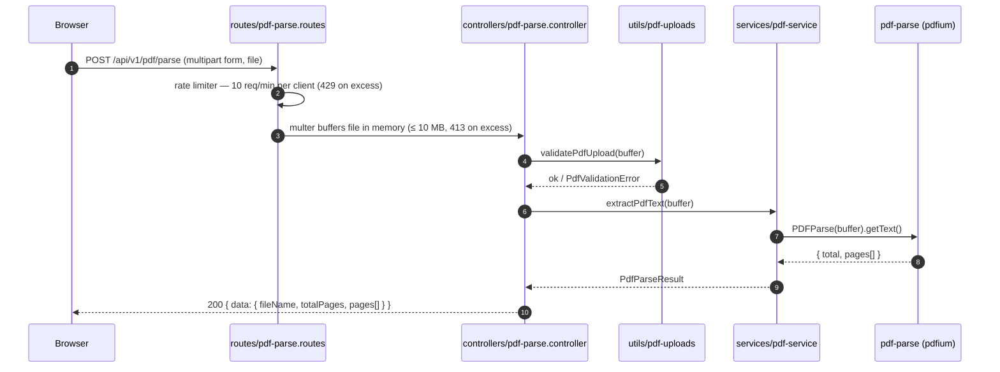

# PDF to Text Converter

A full-stack demo that extracts text from PDF files. Upload a PDF in the browser, the API parses it server-side, and the extracted text is rendered page by page.

## Repository layout

| Path | Purpose |
| --- | --- |
| `apps/web` | React 19 + Vite client: file picker, parse button, page-formatted output |
| `apps/api` | Express 5 API: upload handling, validation, PDF text extraction |
| `packages/shared-types` | Shared domain types and the HTTP contract between web and API |
| `packages/ui-tokens` | Tailwind v4 `@theme` design tokens (single source of truth for styling) |

## Tech stack

- **Frontend**: React 19, Vite, Tailwind CSS v4, custom hooks
- **Backend**: Express 5, multer (in-memory upload), `pdf-parse`, pino (logging), helmet, CORS, express-rate-limit
- **Tooling**: pnpm workspaces, Biome (lint/format), TypeScript (strict), Vitest

## Getting started

```sh
pnpm install
pnpm dev        # runs api + web concurrently
```

Open http://localhost:5173, pick a PDF (≤ 10 MB), click **Parse PDF**.

### Environment variables

| Variable | App | Default | Purpose |
| --- | --- | --- | --- |
| `CORS_ORIGINS` | api | `http://localhost:5173` | Comma-separated allowlist of browser origins |
| `LOG_LEVEL` | api | `info` | pino log level |
| `VITE_API_URL` | web | `http://localhost:3000` | Base URL of the API |

### Scripts

| Command | Description |
| --- | --- |
| `pnpm dev` | Run api + web in watch mode |
| `pnpm build` | Build all workspaces |
| `pnpm test` | Run all tests (Vitest) |
| `pnpm lint` / `pnpm lint:fix` | Biome check / auto-fix |
| `pnpm typecheck` | TypeScript check across workspaces |

## How PDF parsing works



### Step by step

1. **Select a file** — `FilePicker` (`apps/web/src/components/ui/file-picker.tsx`) stores a hidden `<input type="file">` ref; `usePdfParse` keeps the selected `File` in state.
2. **Send the upload** — `parsePdfText` (`apps/web/src/lib/parse-pdf.ts`) builds a `FormData` with the file and POSTs it to `${VITE_API_URL}/api/v1/pdf/parse`. Network failures throw `PdfNetworkError`.
3. **Rate limiting** — `parseLimiter` (`apps/api/src/routes/pdf-parse.routes.ts`) allows 10 requests per client per minute, replying with the shared `rate_limit_exceeded` error envelope beyond that.
4. **Buffer the upload** — multer (`apps/api/src/controllers/pdf-parse.controller.ts`) stores the single `file` field in memory, capped at 10 MB. Oversized files become a 413 via `multerErrorHandler`.
5. **Validate the file** — `validatePdfUpload` (`apps/api/src/utils/pdf-uploads.ts`) rejects empty buffers (400), files over the limit (413), and files missing the `%PDF-` magic bytes (415) by throwing `PdfValidationError`.
6. **Extract text** — `extractPdfText` (`apps/api/src/services/pdf-service.ts`) dynamically imports `pdf-parse`, runs `getText()` with table-cell/line heuristics, and always destroys the parser. It returns a `PdfParseResult` with per-page `ParsedPage[]`.
7. **Stamp and respond** — the controller sets `fileName` from the upload metadata, logs timing (request id, size, duration) via pino, and serializes `{ data: PdfParseResult }` — the shape defined in `packages/shared-types`.
8. **Render** — the web client formats pages with `formatPages` (page headers + tab expansion) into the `OutputBox`.

Failures at any stage return the shared error envelope (`{ error: { code, message } }`) using codes from `PdfApiErrorCode`; the browser maps them to user-facing messages via `PdfApiError`.

## Architecture notes

- **Shared contract**: request/response types live in `packages/shared-types` and are consumed by both apps, so the wire format cannot drift.
- **Theming**: all UI styling derives from `packages/ui-tokens/theme.css` — a Tailwind v4 `@theme` block that clears Tailwind's default color/font/size namespaces, so only token values are usable. Biome's `noTailwindArbitraryValue` rule guards against regressions.
- **Validation order**: cheap checks first (empty → size → magic bytes) before paying for the parser; deep structure errors are the parser's job.

## Constraints

- PDF files only, up to 10 MB, one file per request.
- Text extraction quality depends on the PDF's internal structure; scanned/image-only PDFs yield little or no text (no OCR).